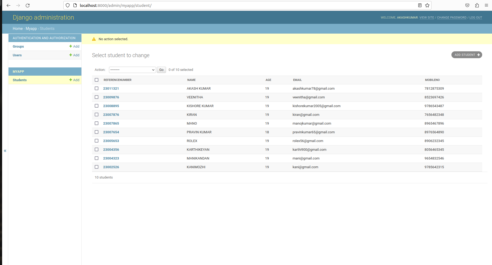

# Django ORM Web Application

## AIM
To develop a Django application to store and retrieve data from a database using Object Relational Mapping(ORM).

## Entity Relationship Diagram

Include your ER diagram here

## DESIGN STEPS

### STEP 1:
Install myapp using command prompt

### STEP 2:
Edit setting.py and model.py

### STEP 3:

create a user name and password usingfor your django 'python manage.py createsuperuser' and then run the program using python manage.py runserver [your port number]"
### STEP 4:
Login with your username and password in django and select student table and then add 10 students details.
### STEP 5:
End the program. 

## PROGRAM

## code to edit in 'models.py'
```
from django.db import models

from django.contrib import admin


# Create your models here.
class Student (models.Model):
    referencenumber=models.CharField(primary_key=True,max_length=20,help_text="reference number")
    name=models.CharField(max_length=100)
    age=models.IntegerField()
    email=models.EmailField()
    mobileno=models.IntegerField()


class StudentAdmin(admin.ModelAdmin):
    list_display=('referencenumber','name','age','email','mobileno')
```
## codes to edit in 'admin.py'
```
from django.contrib import admin
from.models import Student,StudentAdmin
# Register your models here.
admin.site.register(Student,StudentAdmin)
```

## OUTPUT




## RESULT:
The student table is created successfully and the program successfully executed.
